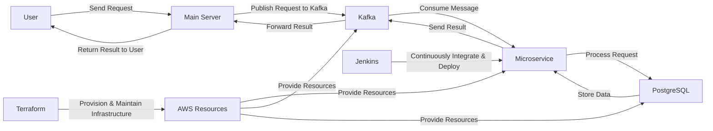

# Event-Driven Mini Bank and Wallet Microservices

The project aims to build a suite of mini bank and wallet microservices that manage essential financial operations. The system is built using Kafka for asynchronous messaging, using PostgreSQL for data storage, ensuring seamless and efficient handling of complex financial workflows. The project will utilize Terraform for infrastructure as code and Jenkins for CI/CD automation, all implemented using Golang.

## Getting Started

### Technologies Used

* Docker
* Docker Compose
* Terraform
* Jenkins
* Go
* PostgreSQL
* AWS
* HTML

# Workflow

The workflow of the microservices-based banking system is as follows:

### User Request

* A user sends a request to the main server (e.g., register an account)

### Message to Kafka

* The main server publishes the request to the appropriate Kafka topic

### Microservice Processing

* The microservice responsible for the specific task consumes the message
* Processes it (e.g., registering the user, scheduling a payment)
* Stores necessary data in PostgreSQL in cloud.

### Response

* The microservice sends the result back to Kafka
* The main server picks up the result and forwards it to the user

### CI/CD and IaC

* Jenkins continuously integrates new changes and deploys them
* Terraform maintains the infrastructure

## Diagram

Here is a diagram of the workflow:



### Running the Application

1. Clone the repository: `https://github.com/jyotiprakashh/minibank_wallet.git`
2. Change into the project directory: `cd minibank_wallet`


## Commands

### Docker Compose
Run the Docker Compose file to build and start the containers for Jenkins, Kafka, and Zookeeper:
```bash
docker-compose up -d
```

To stop and remove the Docker containers, use:
```bash
docker-compose down
```

## Access Jenkins
Open web browser and go to `http://localhost:8080`.
Enter the initial admin password, which can be obtained by running:
```bash
docker exec jenkins cat /var/jenkins_home/secrets/initialAdminPassword
```


### Terraform

*  Initialize the Terraform configuration
 ```bash
terraform init
```
* Validate Terraform Configuration
 ```bash
terraform validate
```
* Plan Terraform Configuration
 ```bash
terraform plan 
```

* Apply the Terraform configuration
```bash
terraform apply
```

* Destroy the Terraform configuration
```bash
terraform destroy
```


## Go
### Run the Main Server

* Run the Go application to start the main server.
```bash
go run orchestration-service/main.go
```

* To run each microservice, go to each directory of every service and run by replacing `servicename` to Folder Name.
```bash
go build -o servicename main.go
./servicename
``` 

### Cool! You can now open the dashboard.html to visualise the workflow live.

## Conclusion
This project leverages microservices, Kafka, AWS RDS, Jenkins, and Terraform to create a scalable, modular, and automated banking system. I would love contributions from your side.


